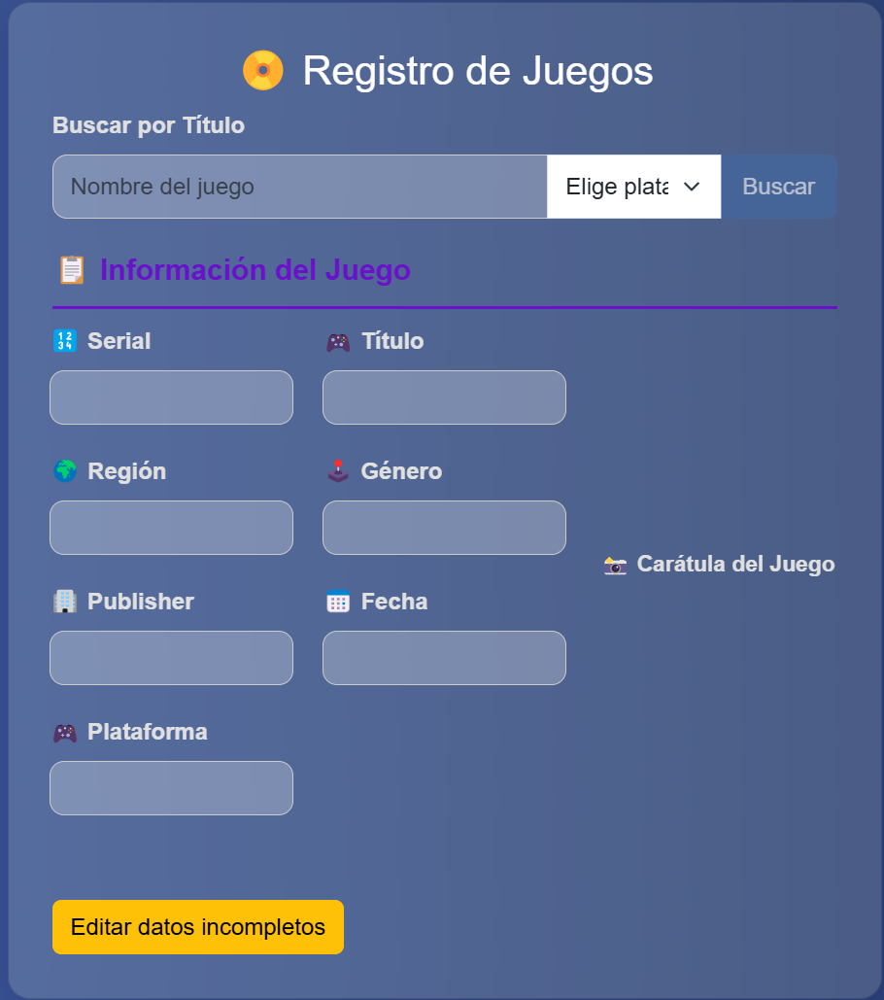

# 🎮 ListaJuegos

<p align="center">
  
</p>

> <strong>Gestor avanzado de base de datos y carátulas para juegos de PlayStation (PSX y PS2)</strong>

<p align="center">
  <a href="#características-principales">✨ Características</a> •
  <a href="#instalación-y-primeros-pasos">🚀 Instalación</a> •
  <a href="#seguridad-y-buenas-prácticas">🛡️ Seguridad</a> •
  <a href="#créditos-y-agradecimientos">🤝 Créditos</a>
</p>

---

## 📑 Tabla de Contenidos

- [📝 Descripción general](#descripción-general)
- [✨ Características principales](#características-principales)
- [🔎 Vista principal del buscador](#vista-principal-del-buscador)
- [📁 Estructura profesional del proyecto](#estructura-profesional-del-proyecto)
- [⚙️ Proceso de funcionamiento detallado](#proceso-de-funcionamiento-detallado)
- [🛠️ Utilidades y scripts incluidos](#utilidades-y-scripts-incluidos)
- [💻 Requisitos del sistema](#requisitos-del-sistema)
- [🚀 Instalación y primeros pasos](#instalación-y-primeros-pasos)
- [🛡️ Seguridad y buenas prácticas](#seguridad-y-buenas-prácticas)
- [📄 Licencia](#licencia)
- [🤝 Créditos y agradecimientos](#créditos-y-agradecimientos)
- [🗄️ Importar la base de datos](#importar-la-base-de-datos)

---

## 📝 Descripción general

ListaJuegos es una aplicación web desarrollada en  y  que permite gestionar, consultar y enriquecer una base de datos de juegos de PlayStation (PSX y PS2).

El sistema está diseñado para ser modular, eficiente y fácil de mantener, integrando importación masiva, búsqueda avanzada y gestión automatizada de carátulas.

---

## ✨ Características principales

- 🔍 **Buscador inteligente y unificado**: búsqueda por título o serial, con coincidencias exactas o sugerencias flexibles.
- 🖼️ **Gestión automática de carátulas**: descarga y almacenamiento desde la web si no existen en la base de datos.
- 📦 **Importación masiva y utilidades**: herramientas para importar listados de juegos y carátulas desde CSV, Excel o scraping.
- 📝 **Gestión y edición de datos**: edición rápida de campos incompletos y visualización clara de la información.
- 🛡️ **Seguridad reforzada**: protección de carpetas sensibles y buenas prácticas mediante `.htaccess` y `.gitignore`.
- 📊 **Estadísticas y control de calidad**: identifica juegos con datos incompletos y facilita su corrección.
- 🧩 **Código modular y limpio**: utilidades agrupadas en la carpeta `utilidad/`.
- 🔗 **API RESTful**: endpoint para integraciones externas y automatización.
- 📚 **Documentación clara** y estructura profesional.

---

## 🔎 Vista principal del buscador

A continuación se muestra la interfaz principal del sistema:

<p align="center">
  
</p>

---

## 📁 Estructura del proyecto

```text
listajuegos/
├── banderas/                  # Imágenes de banderas de regiones
│   ├── europa.png
│   ├── ntsc.png
│   ├── ntsc_c.png
│   ├── ntsc_j.png
│   ├── ntsc_u.png
│   └── pal.png
├── buscar_api.php             # API REST para búsqueda (GET)
├── buscar_datos.php           # Backend de búsqueda (POST)
├── caratulas/                 # Imágenes de carátulas y capturas
│   ├── default.jpg
│   ├── psx.png
│   └── captura.png
├── composer.json              # Dependencias de Composer
├── .env.example               # Variables de entorno (ejemplo)
├── .gitignore                 # Exclusiones para Git
├── .htaccess                  # Reglas de seguridad para Apache
├── index.php                  # Interfaz principal (frontend)
├── juegos_incompletos.php     # Listado de juegos con datos faltantes
├── Log/                       # Carpeta de logs
├── README.md                  # Documentación principal
├── sql/                      # Copia de la base de datos (exportación)
│   └── listajuegos.sql       # Archivo SQL para importar
├── utilidad/                  # Funciones auxiliares y utilidades
│   ├── guardar_imagen.php     # Descarga y guarda carátulas
│   └── utilidades.php         # Funciones comunes (conexión BD, logs...)
└── vendor/                    # Dependencias externas (Composer)
```

---

## ⚙️ Proceso de funcionamiento detallado

1. **Búsqueda de juegos:** El usuario introduce un título o serial y selecciona la plataforma. El frontend envía la petición a `buscar_datos.php` (POST), que consulta la base de datos y devuelve los datos en JSON.
2. **Carga y gestión de carátulas:** Si el juego tiene carátula en la base de datos, se muestra directamente. Si no, el sistema busca la imagen en la web (ej. psxdatacenter.com), la descarga y la almacena automáticamente.
3. **Edición y actualización:** El usuario puede editar campos incompletos y guardar los cambios, que se actualizan en la base de datos.
4. **Importación masiva:** Utilidades para importar listados de juegos y carátulas desde archivos externos.
5. **Control de calidad:** El sistema identifica juegos con datos incompletos y facilita su corrección.

---

## 🛠️ Utilidades y scripts incluidos

- **utilidad/utilidades.php**: Funciones comunes para limpieza, conexión a la base de datos, logs y utilidades generales.
- **utilidad/guardar_imagen.php**: Descarga y guarda carátulas en la base de datos de forma automática.
- **juegos_incompletos.php**: Listado y control de juegos con información faltante.
- **buscar_api.php**: API REST para búsquedas rápidas (GET).
- **buscar_datos.php**: Backend de búsqueda y gestión de datos (POST).

---

## 💻 Requisitos del sistema

-  PHP 7.4 o superior
-  MySQL/MariaDB
-  Servidor Apache recomendado
-  Composer para dependencias

---

## 🚀 Instalación y primeros pasos

1. Clona el repositorio en tu servidor local (por ejemplo, XAMPP `htdocs`).
2. Configura la base de datos MySQL y ajusta los datos de conexión en los scripts si es necesario.
3. Ejecuta `composer install` para instalar dependencias.
4. Accede a `index.php` desde tu navegador para comenzar a utilizar el sistema.

---

## 🛡️ Seguridad y buenas prácticas

- Validación estricta de entradas y manejo de errores para evitar inyecciones SQL y vulnerabilidades comunes.
- El acceso a scripts de importación y utilidades debe restringirse a usuarios autorizados.
- `.htaccess` y `.gitignore` protegen carpetas internas y archivos sensibles.
- No se almacena ni expone información privada en el repositorio.

---

## 🗄️ Importar la base de datos

> Por motivos de tamaño y privacidad, **el archivo completo de base de datos (`sql/listajuegos.sql`) no se incluye en el repositorio**. Puedes solicitarlo o descargarlo desde un enlace externo si está disponible.

Para que puedas utilizar la base de datos del proyecto, sigue estos pasos:

### Usando phpMyAdmin

1. Abre **phpMyAdmin** en tu navegador (por ejemplo, http://localhost/phpmyadmin).
2. Crea una nueva base de datos llamada, por ejemplo, `listajuegos`.
3. Selecciona la base de datos recién creada en el panel izquierdo.
4. Haz clic en la pestaña **Importar**.
5. Pulsa en **Seleccionar archivo** y elige el archivo `sql/listajuegos.sql` incluido en el repositorio.
6. Haz clic en **Continuar** para importar la estructura y los datos.

### Usando la terminal (opcional)

Si prefieres la línea de comandos y tienes acceso a `mysqldump` o `mysql`:

```sh
mysql -u tu_usuario -p nombre_base_datos < sql/listajuegos.sql
```
- Cambia `tu_usuario` por tu usuario de MySQL y `nombre_base_datos` por el nombre de la base de datos que hayas creado.

---

## 📄 Licencia

Este proyecto se distribuye bajo la licencia MIT. Consulta el archivo [LICENSE](LICENSE) para más detalles.

---

## 🤝 Créditos y agradecimientos

- Inspirado en la comunidad de preservación de videojuegos y coleccionismo.
- Fuentes externas para carátulas: [psxdatacenter.com](https://psxdatacenter.com), entre otras.
- Agradecimientos a colaboradores y usuarios que han aportado ideas y mejoras.

---

<p align="center">
  <b>¿Tienes dudas, sugerencias o quieres contribuir?</b> <br>
  ¡Abre un <a href="https://github.com/">issue</a> o <a href="https://github.com/">pull request</a> en GitHub!
</p>
